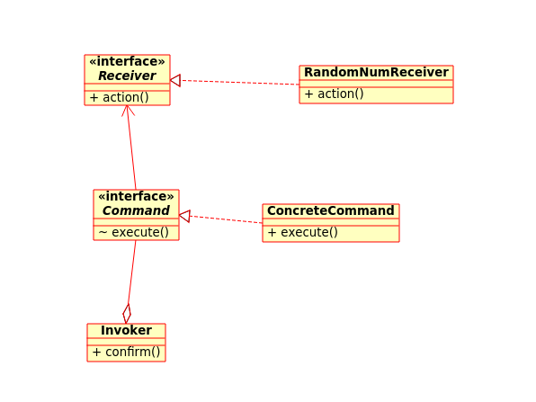

# Emacs, GDB and C++ example

* This example is implemented by C++ and Command pattern. 

* Class diagram 

* [Slide](slide/gdb_exercise.pdf)

## Exersise [Cheat_GDB.txt](https://raw.githubusercontent.com/GenKawamura/cpp_debug/master/Cheat_GDB.txt)

 * Clone the repository on GitHub

   	     $ git clone https://github.com/GenKawamura/cpp_debug
	     $ cd cpp_debug

 * Compile with simbol table (with '-g' option = GDB flags)

   	    $ g++ -g main.cpp RandomNumCommand.cpp -o random
	    $ gdb random

 * In Emacs, run 'M-x gdb'

 * Run
 * Set a break point
 * Fix the code
 * Use std::iterator

## Reference

* [C++ Desigh Pattern in GitHub](https://github.com/JakubVojvoda/design-patterns-cpp)
* [Software Design Pattern in Wikipedia](https://en.wikipedia.org/wiki/Software_design_pattern)
